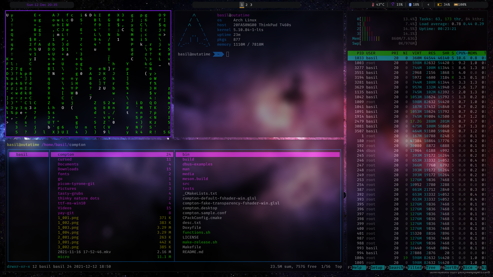

# Galaxy Rice

These is a galaxy themed skin for i3 window manager.

You will need to change some configs to fit your files and preferences and maybe tweak the icons on polybar etc. 

Most of the other things should be self explanatory.

## Dependencies

### Fonts

- FiraCode Nerd Font
- Material Design Icons
- FontAwesome

### Software Used
- **Window Manager:** i3-radius/gaps
- **Application Menu:** rofi 
- **Notifications:** [dunst](https://github.com/dunst-project/dunst)
- **Top Bar:** polybar
- **Compositor:** [picom (tryone's fork)](https://github.com/tryone144/compton) 
- **TUI file manager:** ranger 
- **Wallpaper:** [wallpaper](https://github.com/UwUham/galaxy-rice-dots/raw/main/wallpaper.jpg)

## Installation
- These dotfiles have been made to work most easily with Arch Linux, however I believe that most other distros have the required packages available.

### Dependencies

#### Arch Linux
`yay -S --needed - < dependencies.txt`

#### Other distributions
You need to figure out where and how to find and install these fonts and
programs yourself. Most should be available through your distributions package
manager, and those that aren't (picom) can be somewhat easily compiled:
[tryone's fork of picom](https://github.com/tryone144/compton)  is documented towards Ubuntu and other Debian based
distributions.

### Applying dotfiles (assuming that you have installed all dependencies)
```
cd
git clone https://github.com/UwUham/galaxy-rice-dots
cp -r .config .config-bak
cd galaxy-rice-dots/.config
cp -r * ~/.config
```
### Reverting to your old dotfiles
```
cd
rm -rf .config
cp .config-bak .config
```

## Screenshot

</img>
